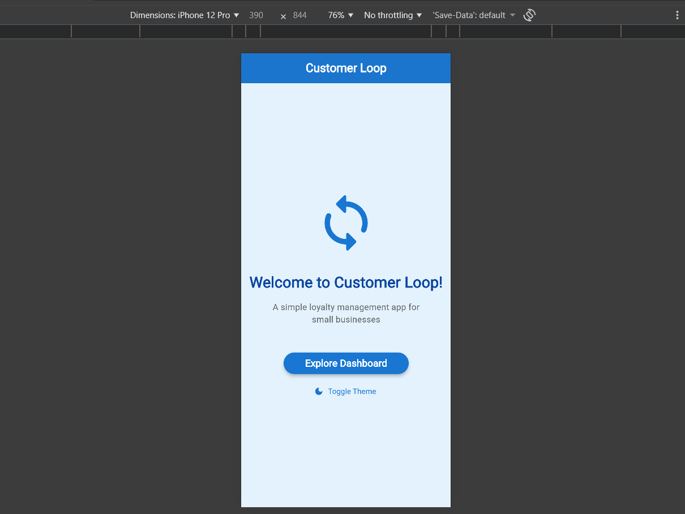
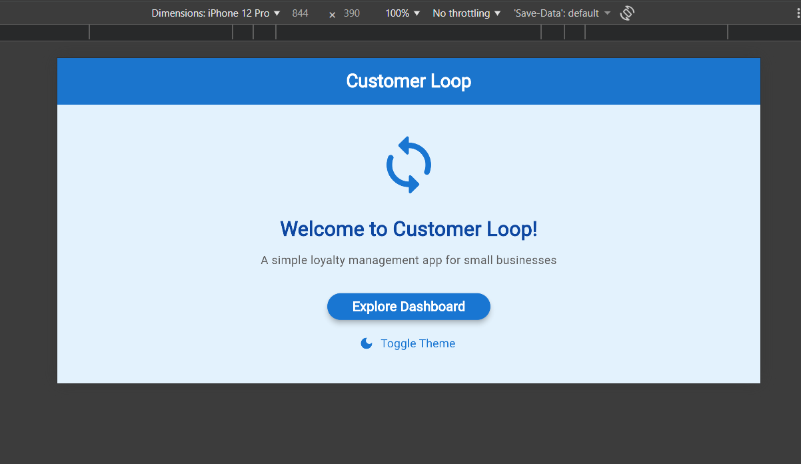
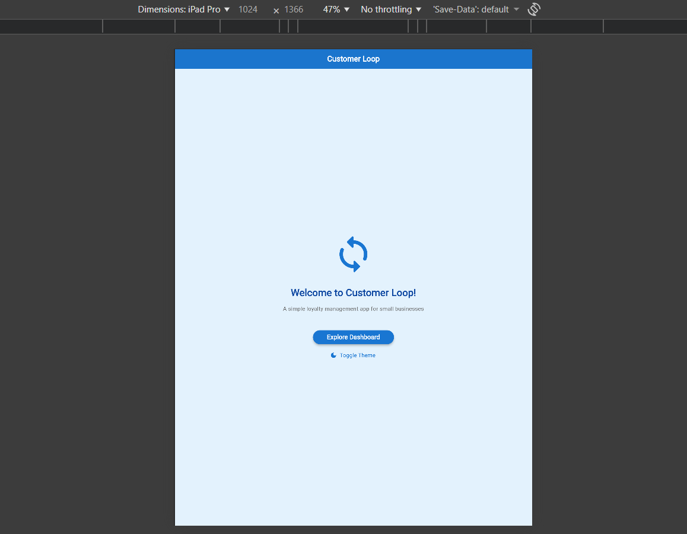
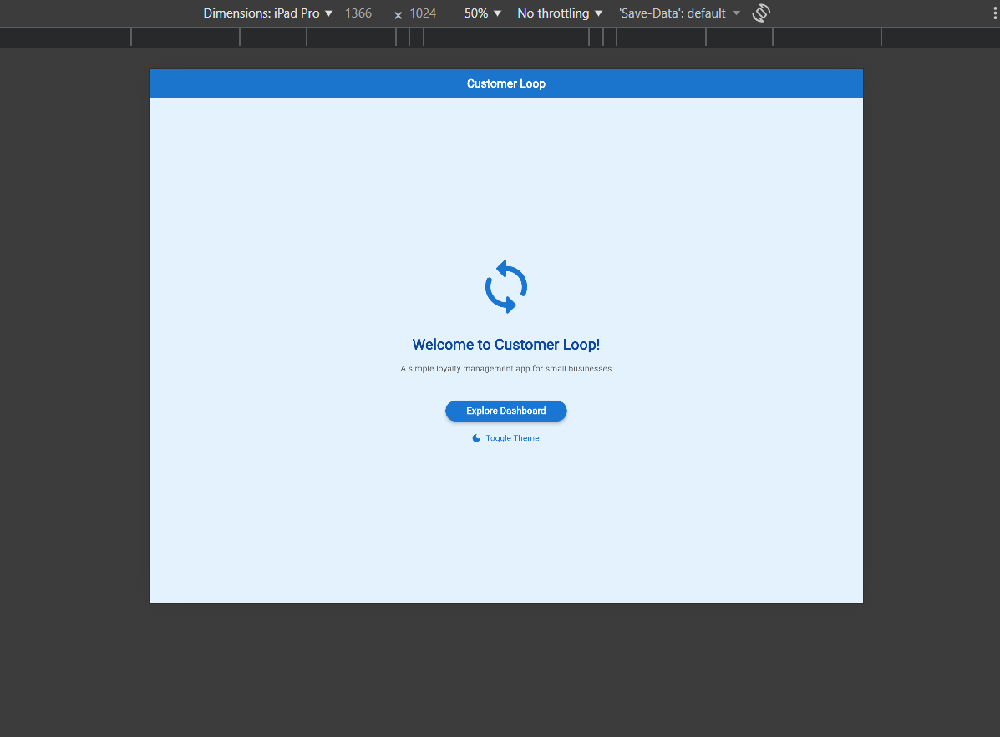
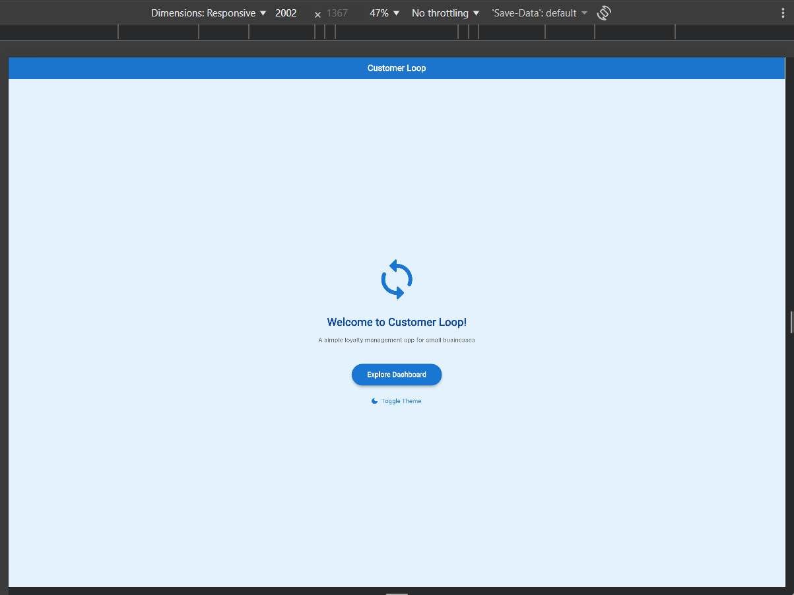

# 🔁 Customer Loop

## 🧩 Problem Statement

Small businesses in Tier-2 and Tier-3 towns struggle to retain customers due to the absence of simple, affordable digital loyalty tools. Most shop owners rely on manual methods such as physical loyalty cards or memory, which are inefficient, error-prone, and do not scale with business growth.

---

## 💡 Solution Overview

**Customer Loop** is a **mobile-first loyalty management application** built using **Flutter** and **Firebase**.  
It helps small business owners digitally track repeat customers, record visits, and reward loyalty through a **points-based system**.

### 🔄 How Customer Loop Works
- Shop owners register and log in securely
- Customers are added and managed digitally
- Each visit earns reward points
- Points can be redeemed as:
  - **Instant discounts at the same shop**
  - **Products from an in-app rewards catalog** (MVP demo feature)

Firebase ensures **secure authentication** and **real-time data synchronization**, enabling instant updates across devices.

---

## 🎯 Target Users

- Small business owners  
  *(local shops, cafes, salons, service providers)*
- Their repeat customers

---

## 🚀 Why Flutter + Firebase?

- **Flutter** enables fast, cross-platform mobile app development
- **Firebase** removes backend complexity by providing:
  - Authentication
  - Cloud Firestore (real-time database)
  - Scalable infrastructure

This combination allows rapid MVP development with reliable performance.

---

## 📦 Scope & Boundaries

### ✅ In Scope
- Firebase Authentication (Login / Register)
- Cloud Firestore for customer, visit, and reward data
- Customer visit tracking & points accumulation
- Reward redemption (discounts & rewards catalog)
- Core Flutter screens:
  - Login
  - Dashboard
  - Customers
  - Rewards
- Real-time data synchronization

### ❌ Out of Scope
- Online payments
- Product delivery or shipping
- Push notifications
- Advanced analytics
- Multi-language support

---

## 👥 Team Roles & Responsibilities

| Role | Team Member | Responsibilities |
|----|----|----|
| UI & UX Lead | Keerthana | Wireframes, Flutter UI, navigation, layouts |
| Firebase Lead | Chetan | Firebase Auth, Firestore schema, security rules |
| Integration & Testing Lead | Dinesh | UI–Firebase integration, testing, APK build |

---

## 🗓️ Sprint Timeline (4 Weeks)

| Week | Focus Area | Deliverables |
|----|----|----|
| Week 1 | Setup & Design | Finalize idea, wireframes, Firebase setup |
| Week 2 | Core Development | Auth flows, Firestore CRUD, dashboard UI |
| Week 3 | Integration & Testing | Real-time sync, validations, testing |
| Week 4 | MVP Completion | UI polish, documentation, demo APK |

---

## 🧪 MVP – Minimum Viable Product

### ✅ MVP Features
- Secure authentication using Firebase Auth
- Firestore-based customer & visit management
- Automatic points accumulation
- Reward redemption system
- Real-time UI updates
- Demo-ready APK

---

## 📊 Success Metrics

- All MVP features implemented successfully
- Firebase Authentication and Firestore fully integrated
- Real-time data updates demonstrated
- Working APK shared
- Positive mentor evaluation feedback

---

## ⚠️ Risks & Mitigation

| Risk | Impact | Mitigation |
|----|----|----|
| Firebase configuration issues | Development delay | Early setup & validation |
| UI integration bugs | Demo instability | Incremental testing |
| Time constraints | Feature reduction | Strict MVP focus |

---

## 🏁 Conclusion

**Customer Loop** provides a simple, scalable, and affordable loyalty solution for small businesses.  
By digitizing customer engagement and rewards, it helps shop owners build long-term relationships while keeping the system easy to use and maintain.

---

## 📁 Flutter Project Folder Structure

The project follows a clean, modular architecture that promotes scalability and maintainability:

```
customerloop/lib/
├── main.dart          # Entry point - initializes app and sets up routing
├── screens/           # Individual UI screens (Login, Dashboard, Customers, Rewards)
├── widgets/           # Reusable UI components (buttons, cards, input fields)
├── models/            # Data structures (Customer, Visit, Reward models)
└── services/          # Firebase & API logic (auth, firestore operations)
```

### 📂 Directory Purposes

| Directory | Purpose | Example Files |
|-----------|---------|---------------|
| **screens/** | Full-page views representing different app sections | `login_screen.dart`, `dashboard_screen.dart`, `customers_screen.dart` |
| **widgets/** | Reusable UI components used across multiple screens | `custom_button.dart`, `customer_card.dart`, `stats_widget.dart` |
| **models/** | Data classes defining structure of entities | `customer.dart`, `visit.dart`, `reward.dart` |
| **services/** | Business logic, Firebase integration, and API calls | `auth_service.dart`, `firestore_service.dart`, `rewards_service.dart` |

### 🎯 Benefits of This Structure

- **Modularity**: Each folder has a single responsibility, making code easier to understand
- **Scalability**: New features can be added without disrupting existing code
- **Reusability**: Widgets and services can be shared across multiple screens
- **Maintainability**: Clear organization makes debugging and updates faster
- **Team Collaboration**: Multiple developers can work on different modules simultaneously

### 📝 Naming Conventions

- **Files**: `snake_case` (e.g., `customer_screen.dart`, `auth_service.dart`)
- **Classes**: `PascalCase` (e.g., `CustomerScreen`, `AuthService`)
- **Variables/Functions**: `camelCase` (e.g., `userName`, `getUserData()`)
- **Private members**: Prefix with underscore (e.g., `_counter`, `_updateState()`)

---

## 🚀 Setup Instructions

### Prerequisites

Before you begin, ensure you have the following installed:

- **Flutter SDK** (v3.0 or higher)
- **Android Studio** or **VS Code** with Flutter & Dart extensions
- **Git** for version control
- A physical device or emulator for testing

### Step 1: Install Flutter SDK

#### Windows
1. Download Flutter SDK from [flutter.dev](https://flutter.dev)
2. Extract to `C:\src\flutter`
3. Add Flutter to PATH:
   - Search "Environment Variables" → Edit System Variables
   - Add `C:\src\flutter\bin` to Path
4. Verify installation:
   ```bash
   flutter doctor
   ```

#### macOS/Linux
```bash
git clone https://github.com/flutter/flutter.git -b stable
export PATH="$PATH:`pwd`/flutter/bin"
flutter doctor
```

### Step 2: Set Up Android Studio / VS Code

**Android Studio:**
- Install Flutter and Dart plugins
- Set up Android SDK and emulator

**VS Code:**
```bash
# Install extensions
code --install-extension Dart-Code.flutter
code --install-extension Dart-Code.dart-code
```

### Step 3: Clone and Run This Project

```bash
# Navigate to the project folder
cd customerloop

# Get dependencies
flutter pub get

# Run the app
flutter run
```

### Step 4: Verify Installation

Run `flutter doctor` to check for any missing dependencies:

```bash
flutter doctor -v
```

All checkmarks should be green. If issues appear, follow the suggested fixes.

---

## 🎨 Demo

### Welcome Screen

The app now features a custom **Welcome Screen** with:
- ✅ **AppBar** with "Customer Loop" title
- ✅ **Dynamic Icon** that changes on button press
- ✅ **Column Layout** with centered content
- ✅ **State Management** - button toggles theme and text
- ✅ **Smooth Animations** and Material Design 3


### Responsive Dashboard

The **Responsive Home Screen** demonstrates advanced Flutter responsive design:
- ✅ **MediaQuery** for dynamic screen size detection
- ✅ **Adaptive Layouts** - Single column (phone), Multi-column (tablet/desktop)
- ✅ **Flexible & Expanded Widgets** for scalable UI components
- ✅ **GridView** with dynamic column count based on device type
- ✅ **LayoutBuilder** for constraint-based rendering
- ✅ **Wrap Widget** for responsive button arrangements
- ✅ **FittedBox** to prevent text overflow
- ✅ **Portrait & Landscape** orientation support

#### 📱 Phone View (< 600px width)
- Single-column layout for stats cards
- Compact navigation
- Vertical scrolling optimized




#### 📱 Tablet View (600px - 1200px width)
- Two-column grid for customer cards
- Expanded stats in horizontal row
- Enhanced spacing and typography




#### 🖥️ Desktop View (> 1200px width)
- Three-column grid for maximum space utilization
- Larger text and padding
- Optimized for wide screens



---

## **State Management with setState**

- **File added:** `customerloop/lib/screens/state_management_demo.dart`

This small demo shows local UI state management using a `StatefulWidget` and the `setState()` method. The counter increments and decrements, and the screen background changes color when the count reaches a threshold.

Code snippet (core `setState` usage):

```dart
void _incrementCounter() {
  setState(() {
    _counter++;
  });
}

void _decrementCounter() {
  setState(() {
    if (_counter > 0) _counter--;
  });
}
```

Conditional UI based on local state (background color change):

```dart
Container(
  color: _counter >= 5 ? Colors.greenAccent : Colors.white,
  child: Center(child: Text('Count: $_counter')),
)
```

Screenshots
- Add two screenshots to `customerloop/screenshots/`: `state_before.png` and `state_after.png` showing the UI before and after reaching the threshold. Insert them here or attach in your PR.

Reflection
- **Stateless vs Stateful:** `StatelessWidget` has no mutable state and renders static content. `StatefulWidget` holds mutable state in a separate `State` object that can change over time.
- **Why `setState()` matters:** Calling `setState()` tells Flutter that the widget's internal state changed and the framework should schedule a rebuild. Without it, UI will not update.
- **Performance caveats:** Overusing `setState()` or calling it unnecessarily can trigger extra rebuilds. Keep the widget tree small, lift state up when appropriate, and consider finer-grained state management for complex apps.

How to run the demo
1. From project root run:

```bash
cd customerloop
flutter pub get
flutter run
```

2. Navigate to the screen by pushing `StateManagementDemo` from any existing route, for example in `main.dart` add a route:

```dart
routes: {
  '/state-demo': (ctx) => const StateManagementDemo(),
},
```

Submission / PR instructions
- Commit message: `feat: implemented local state management using setState`
- PR title: `[Sprint-2] State Management with setState – TeamName`
- PR description should include:
  - Summary of what was implemented
  - Screenshots (`state_before.png`, `state_after.png`) or links
  - A short reflection (answer the three reflection bullets above)
  - Video demo link (1–2 minutes) showing real-time updates and explanation of how `setState()` triggers rebuilds. Ensure the shared link is set to "Anyone with the link".

Video demo guidance
- Record a 1–2 minute video demonstrating:
  - Counter increment/decrement
  - Background color change at threshold
  - Brief explanation of how `setState()` updates the UI
- Upload to Google Drive, Loom, or YouTube (unlisted) and add the link to the PR description.

If you want, I can also create a simple Git branch, commit, and push these changes and open the PR draft for you — tell me the remote name and preferred branch name.


## 📱 Responsive Design Implementation

### Responsive Dashboard

The Responsive Dashboard demonstrates Flutter responsive design using MediaQuery and LayoutBuilder to ensure the UI adapts seamlessly across phones, tablets, and desktops. The layout dynamically switches between single and multi-column views, scales spacing and typography, and prevents overflow, delivering a consistent user experience on all screen sizes.

The Responsive Home Screen demonstrates advanced Flutter responsive design:
-  MediaQuery for dynamic screen size detection
-  Adaptive Layouts – Single column (phone), Multi-column (tablet/desktop)
-  Flexible & Expanded Widgets for scalable UI components
-  GridView with dynamic column count based on device type
-  LayoutBuilder for constraint-based rendering
-  Wrap Widget for responsive button arrangements
-  FittedBox to prevent text overflow
-  Portrait & Landscape orientation support

### 🔍 MediaQuery Usage

We use `MediaQuery` to detect screen dimensions and adapt the UI dynamically:

```dart
// Get screen dimensions
final screenWidth = MediaQuery.of(context).size.width;
final screenHeight = MediaQuery.of(context).size.height;
final orientation = MediaQuery.of(context).orientation;

// Determine device type
final bool isPhone = screenWidth < 600;
final bool isTablet = screenWidth >= 600 && screenWidth < 1200;
final bool isDesktop = screenWidth >= 1200;

// Dynamic padding based on screen size
final double horizontalPadding = isPhone ? 16.0 : (isTablet ? 32.0 : 48.0);
final double verticalPadding = isPhone ? 12.0 : (isTablet ? 20.0 : 24.0);

// Dynamic text sizes
final double titleSize = isPhone ? 24.0 : (isTablet ? 32.0 : 40.0);
final double subtitleSize = isPhone ? 14.0 : (isTablet ? 16.0 : 18.0);
final double bodySize = isPhone ? 16.0 : (isTablet ? 18.0 : 20.0);
```

### 🎯 LayoutBuilder for Constraint-Based Layouts

`LayoutBuilder` allows us to build UI based on parent constraints:

```dart
body: LayoutBuilder(
  builder: (context, constraints) {
    return SingleChildScrollView(
      padding: EdgeInsets.symmetric(
        horizontal: horizontalPadding,
        vertical: verticalPadding,
      ),
      child: Column(
        // Adaptive content based on constraints
      ),
    );
  },
)
```

### 📊 Adaptive GridView

Grid columns change dynamically based on device type:

```dart
// Grid column count based on device type
final int gridColumns = isPhone ? 1 : (isTablet ? 2 : 3);

GridView.builder(
  gridDelegate: SliverGridDelegateWithFixedCrossAxisCount(
    crossAxisCount: gridColumns,
    crossAxisSpacing: 16,
    mainAxisSpacing: 16,
    childAspectRatio: isPhone ? 3 : 2.5,
  ),
  itemCount: _customers.length,
  itemBuilder: (context, index) {
    return _buildCustomerCard(_customers[index], isPhone, bodySize);
  },
)
```

### 🔄 Flexible & Expanded Widgets

For responsive stat cards that adapt to available space:

```dart
if (isPhone) {
  // Single column layout for phones
  return Column(
    children: stats.map((stat) => 
      Padding(
        padding: const EdgeInsets.only(bottom: 12),
        child: _buildStatCard(stat, subtitleSize, bodySize, true),
      )
    ).toList(),
  );
} else {
  // Row layout with Expanded for tablets and desktops
  return Row(
    children: stats.map((stat) => 
      Expanded(
        child: Padding(
          padding: const EdgeInsets.symmetric(horizontal: 8),
          child: _buildStatCard(stat, subtitleSize, bodySize, false),
        ),
      )
    ).toList(),
  );
}
```

### 📦 Wrap Widget for Responsive Buttons

`Wrap` automatically arranges items based on available space:

```dart
Wrap(
  spacing: 16,
  runSpacing: 12,
  children: [
    _buildInfoChip('Type', deviceType, Icons.phone_android),
    _buildInfoChip('Width', '${screenWidth.toInt()}px', Icons.width_full),
    _buildInfoChip('Height', '${screenHeight.toInt()}px', Icons.height),
    _buildInfoChip('Orientation', 
      orientation == Orientation.portrait ? 'Portrait' : 'Landscape',
      Icons.screen_rotation,
    ),
  ],
)
```

### 🎨 FittedBox to Prevent Overflow

Ensures text scales down instead of overflowing:

```dart
FittedBox(
  fit: BoxFit.scaleDown,
  child: Text(
    'Customer Loop - Responsive Dashboard',
    style: TextStyle(
      fontWeight: FontWeight.bold,
      color: Colors.white,
      fontSize: titleSize * 0.7,
    ),
  ),
)
```

---

## 💭 Reflection

### What I Learned About Dart & Flutter

**Dart Language:**
- Strong typing with null safety ensures fewer runtime errors
- `setState()` is the core of reactive UI updates
- Dart's syntax is clean and easy to learn for those familiar with Java/JavaScript

**Flutter Framework:**
- Everything is a widget - composability is powerful
- Hot reload speeds up development significantly
- Material Design components are ready to use out of the box
- State management (StatefulWidget vs StatelessWidget) is intuitive

### How This Structure Helps Build Complex UIs

1. **Separation of Concerns**: UI (screens/widgets) is separate from logic (services/models)
2. **Component Reusability**: Custom widgets can be used across multiple screens
3. **Easy Testing**: Each module can be tested independently
4. **Firebase Integration**: Services layer provides clean abstraction for backend operations
5. **Future-Proof**: Adding new features (like notifications or analytics) won't require restructuring

### Next Steps

- Build authentication screens using Firebase Auth
- Implement customer management with Firestore
- Create a reward redemption flow
- Add real-time data synchronization
- Test on multiple devices and screen sizes

---

## 🎯 Responsive Design Reflection

### Challenges Faced Making the Layout Responsive

**1. Screen Size Fragmentation**
- **Challenge**: Handling the vast range of device sizes from small phones (320px) to large tablets (1024px+) and desktops
- **Solution**: Implemented breakpoints at 600px (phone/tablet) and 1200px (tablet/desktop) using MediaQuery
- **Learning**: Creating device-type booleans (`isPhone`, `isTablet`, `isDesktop`) made conditional logic cleaner

**2. Text Overflow Issues**
- **Challenge**: Text elements would overflow on smaller screens, especially in landscape mode
- **Solution**: Used `FittedBox` with `BoxFit.scaleDown` to automatically shrink text when space is limited
- **Learning**: `FittedBox` is essential for responsive typography, preventing ugly overflow indicators

**3. Layout Switching**
- **Challenge**: Switching between Column (phone) and Row (tablet) layouts for the same content
- **Solution**: Used conditional rendering based on screen width with separate layout builders
- **Learning**: Ternary operators and helper methods keep the code readable while handling multiple layout variations

**4. Grid Responsiveness**
- **Challenge**: Customer cards needed different column counts on different devices
- **Solution**: Dynamic `crossAxisCount` in `GridView.builder` based on device type (1 for phone, 2 for tablet, 3 for desktop)
- **Learning**: `GridView` is incredibly powerful for responsive lists when combined with dynamic parameters

**5. Orientation Changes**
- **Challenge**: Portrait to landscape transitions would break layouts or waste space
- **Solution**: Used `MediaQuery.of(context).orientation` and adjusted `childAspectRatio` accordingly
- **Learning**: Listening to orientation changes requires rebuilding the entire widget tree, so efficient use of `LayoutBuilder` is crucial

**6. Dynamic Spacing**
- **Challenge**: Fixed padding looked cramped on phones and wasteful on tablets
- **Solution**: Created scaling functions for padding, margins, and sizes based on device type
- **Learning**: Responsive design isn't just about layout - spacing, typography, and touch targets all need to scale

**7. Navigation Footer**
- **Challenge**: Bottom navigation with labels would overflow on small screens in landscape
- **Solution**: Combined `Expanded` widgets with `FittedBox` to ensure labels always fit
- **Learning**: Combining multiple responsive widgets (Expanded + FittedBox) solves complex constraints

**8. Performance with LayoutBuilder**
- **Challenge**: Overusing `LayoutBuilder` and `MediaQuery` could cause unnecessary rebuilds
- **Solution**: Calculated breakpoints once in the main build method, passed values down to children
- **Learning**: Cache expensive calculations; don't call `MediaQuery.of(context)` in every child widget

### How Responsive Design Improves Real-World App Usability

**1. Universal Accessibility**
- **Impact**: A single codebase serves phones, tablets, and web browsers
- **User Benefit**: Small business owners can access the app on any device they have available
- **Real-World Example**: A shop owner can track customers on their phone while a receptionist uses a tablet at the counter

**2. Better User Experience Across Devices**
- **Impact**: Content is optimized for each screen size, not just "shrunk down"
- **User Benefit**: On tablets, users see more information at once (2-3 column grids vs single column)
- **Real-World Example**: Viewing the customer list is faster on tablets with multi-column layouts, reducing scrolling

**3. Orientation Flexibility**
- **Impact**: App works seamlessly in both portrait and landscape modes
- **User Benefit**: Users can hold their device naturally without being forced into one orientation
- **Real-World Example**: Landscape mode on a tablet provides a dashboard-like experience similar to desktop software

**4. Future-Proof Design**
- **Impact**: As new devices with different screen sizes emerge, the app adapts automatically
- **User Benefit**: No need to download different versions for different devices
- **Real-World Example**: Works on foldable phones, iPads, and future devices without code changes

**5. Accessibility and Readability**
- **Impact**: Text and touch targets scale appropriately, meeting accessibility guidelines
- **User Benefit**: Easier to read and interact with, especially for users with visual impairments
- **Real-World Example**: Buttons are large enough on phones (44x44pt minimum) and don't become comically large on tablets

**6. Professional Appearance**
- **Impact**: The app doesn't look "stretched" or "squished" on any device
- **User Benefit**: Builds trust in the software; polished UI = reliable product
- **Real-World Example**: Business owners are more likely to adopt a tool that looks professional on their device

**7. Reduced Development Time**
- **Impact**: One responsive codebase instead of multiple platform-specific apps
- **User Benefit**: Faster updates and bug fixes across all platforms
- **Real-World Example**: A new feature developed once works on all devices immediately

**8. Cost Efficiency**
- **Impact**: No need to maintain separate iOS, Android, and web codebases
- **User Benefit**: Lower development costs can translate to cheaper or free apps for small businesses
- **Real-World Example**: Small businesses in Tier-2/3 cities can afford this solution

### Key Takeaways

1. **MediaQuery is Your Friend**: Use it early and often to detect device characteristics
2. **Think in Breakpoints**: Design for small (phone), medium (tablet), and large (desktop) screens
3. **Flexible Beats Fixed**: Use `Expanded`, `Flexible`, and percentage-based sizing over fixed pixel values
4. **Test Early, Test Often**: Run on real devices or emulators of different sizes throughout development
5. **Mobile-First Approach**: Design for the smallest screen first, then enhance for larger screens
6. **Performance Matters**: Don't over-engineer; simple breakpoints often work better than complex calculations
7. **User-Centered Design**: Responsive design is about usability, not just aesthetics

### Next Steps for Enhanced Responsiveness

- Implement landscape-specific layouts for complex screens
- Add dark mode support with `MediaQuery.platformBrightness`
- Use `MediaQuery.textScaleFactor` for accessibility font scaling
- Test on physical devices (not just emulators) for real-world validation
- Consider using responsive frameworks like `flutter_screenutil` for larger projects

---

## 🖼️ Asset Management in Flutter

This section focuses on managing local assets such as images and icons in Flutter. The goal is to correctly organize asset folders, register them in `pubspec.yaml`, and display them in the UI using `Image.asset` and Flutter’s built-in `Icon` widgets. Proper asset management ensures clean project structure, prevents runtime errors, and supports scalable UI development.

Key concepts implemented:
-  Organized asset folders (`assets/images`, `assets/icons`)
-  Asset registration in `pubspec.yaml`
-  Displaying local images using `Image.asset`
-  Using Material and Cupertino icons
-  Combining images and icons in UI layouts
-  Handling common asset errors (paths, YAML indentation, hot reload)
-  Testing assets across different screen sizes


## 📝 User Input & Form Validation

### Why Input Validation is Critical in Mobile Apps

Input validation is a fundamental security and user experience practice that ensures data integrity and protects both users and the application. Here's why it's essential:

#### 1. **Security Protection**
- **Prevents SQL Injection**: Validating input prevents malicious code from being executed
- **Prevents XSS Attacks**: Sanitizing user input protects against cross-site scripting
- **Data Integrity**: Ensures only valid, expected data enters your Firebase database
- **Example**: Without email validation, a user could enter `<script>alert('hacked')</script>` instead of an email

#### 2. **User Experience**
- **Immediate Feedback**: Users know instantly if their input is correct
- **Prevents Frustration**: Catching errors before submission saves time
- **Clear Error Messages**: Users understand exactly what needs correction
- **Example**: "Please enter a valid email" is clearer than a generic Firebase error

#### 3. **Data Quality**
- **Consistency**: All data follows the same format (e.g., all emails have @)
- **Completeness**: Required fields are never empty
- **Accuracy**: Phone numbers, emails, and names are in correct formats
- **Example**: A loyalty app needs accurate phone numbers to identify returning customers

#### 4. **Business Logic**
- **Prevents Invalid States**: Users can't submit incomplete or incorrect data
- **Reduces Support Tickets**: Fewer user errors = fewer complaints
- **Database Efficiency**: Clean data is easier to query and analyze
- **Example**: Validating minimum password length prevents weak passwords

### TextField vs TextFormField: Key Differences

| Feature | TextField | TextFormField |
|---------|-----------|---------------|
| **Purpose** | Basic text input | Form-aware text input with built-in validation |
| **Validation** | Manual validation required | Built-in `validator` property |
| **Form Integration** | Not form-aware | Automatically integrated with `Form` widget |
| **Error Handling** | Manual error display | Automatic error text below field |
| **State Management** | Manual | Managed by `FormState` |
| **Use Case** | Simple inputs, search bars | Login forms, registration, data entry |
| **GlobalKey** | Not needed | Works with `GlobalKey<FormState>` |

**When to Use TextField:**
- Search bars
- Chat message inputs
- Quick filters
- Single standalone inputs

**When to Use TextFormField:**
- Login/signup forms
- Multi-field forms
- Data entry requiring validation
- When you need form-level validation

### Form State Management with GlobalKey<FormState>

The `GlobalKey<FormState>` is a powerful Flutter pattern that simplifies form validation:

```dart
final _formKey = GlobalKey<FormState>();

Form(
  key: _formKey,
  child: Column(
    children: [
      TextFormField(/* ... */),
      TextFormField(/* ... */),
      ElevatedButton(
        onPressed: () {
          if (_formKey.currentState!.validate()) {
            // All validators passed
            _formKey.currentState!.save();
            // Process form
          }
        },
        child: Text('Submit'),
      ),
    ],
  ),
)
```

**How It Works:**
1. **Key Assignment**: `GlobalKey` gives the Form widget a unique identifier
2. **State Access**: `_formKey.currentState` accesses the form's validation methods
3. **Validation**: `.validate()` runs all `validator` functions in child TextFormFields
4. **Result**: Returns `true` if all validators pass, `false` otherwise

**Benefits:**
- Validates all fields at once
- No need for individual state variables per field
- Centralized error handling
- Clean, maintainable code

---

## 💻 Code Examples: Input Validation

### Basic TextField Example

```dart
TextField(
  decoration: InputDecoration(
    labelText: 'Search customers',
    prefixIcon: Icon(Icons.search),
    border: OutlineInputBorder(),
  ),
  onChanged: (value) {
    // Handle search
  },
)
```

### TextFormField with Validation

#### Example 1: Name Validation
```dart
TextFormField(
  controller: _nameController,
  decoration: InputDecoration(
    labelText: 'Full Name',
    prefixIcon: Icon(Icons.person),
    border: OutlineInputBorder(
      borderRadius: BorderRadius.circular(12),
    ),
  ),
  validator: (value) {
    if (value == null || value.isEmpty) {
      return 'Please enter your name';
    }
    if (value.length < 2) {
      return 'Name must be at least 2 characters';
    }
    return null; // Valid input
  },
)
```

#### Example 2: Email Validation
```dart
TextFormField(
  controller: _emailController,
  decoration: InputDecoration(
    labelText: 'Email',
    prefixIcon: Icon(Icons.email),
    border: OutlineInputBorder(),
  ),
  keyboardType: TextInputType.emailAddress,
  validator: (value) {
    if (value == null || value.isEmpty) {
      return 'Please enter your email';
    }
    // Basic check for @ symbol
    if (!value.contains('@')) {
      return 'Enter a valid email address';
    }
    // Enhanced regex validation
    final emailRegex = RegExp(r'^[^\s@]+@[^\s@]+\.[^\s@]+$');
    if (!emailRegex.hasMatch(value)) {
      return 'Enter a valid email format (e.g., user@example.com)';
    }
    return null;
  },
)
```

#### Example 3: Password Validation
```dart
TextFormField(
  controller: _passwordController,
  obscureText: _obscurePassword,
  decoration: InputDecoration(
    labelText: 'Password',
    prefixIcon: Icon(Icons.lock),
    suffixIcon: IconButton(
      icon: Icon(
        _obscurePassword ? Icons.visibility_off : Icons.visibility,
      ),
      onPressed: () {
        setState(() {
          _obscurePassword = !_obscurePassword;
        });
      },
    ),
  ),
  validator: (value) {
    if (value == null || value.isEmpty) {
      return 'Please enter a password';
    }
    if (value.length < 6) {
      return 'Password must be at least 6 characters';
    }
    return null;
  },
)
```

### Complete Form with Validation

```dart
class LoginScreen extends StatefulWidget {
  @override
  State<LoginScreen> createState() => _LoginScreenState();
}

class _LoginScreenState extends State<LoginScreen> {
  final _formKey = GlobalKey<FormState>();
  final _emailController = TextEditingController();
  final _passwordController = TextEditingController();
  bool _isLoading = false;

  @override
  void dispose() {
    _emailController.dispose();
    _passwordController.dispose();
    super.dispose();
  }

  Future<void> _handleLogin() async {
    // Validate all fields
    if (!_formKey.currentState!.validate()) {
      return; // Stop if validation fails
    }

    setState(() => _isLoading = true);

    try {
      // Process login
      final user = await _authService.login(
        _emailController.text.trim(),
        _passwordController.text.trim(),
      );
      
      if (user != null) {
        // Success feedback
        ScaffoldMessenger.of(context).showSnackBar(
          SnackBar(
            content: Text('Login successful!'),
            backgroundColor: Colors.green,
          ),
        );
        // Navigate to dashboard
      }
    } catch (e) {
      // Error feedback
      ScaffoldMessenger.of(context).showSnackBar(
        SnackBar(
          content: Text('Login failed: $e'),
          backgroundColor: Colors.red,
        ),
      );
    } finally {
      setState(() => _isLoading = false);
    }
  }

  @override
  Widget build(BuildContext context) {
    return Scaffold(
      body: Form(
        key: _formKey,
        child: Column(
          children: [
            TextFormField(
              controller: _emailController,
              decoration: InputDecoration(labelText: 'Email'),
              validator: (value) {
                if (value == null || value.isEmpty) {
                  return 'Please enter your email';
                }
                final emailRegex = RegExp(r'^[^\s@]+@[^\s@]+\.[^\s@]+$');
                if (!emailRegex.hasMatch(value)) {
                  return 'Please enter a valid email';
                }
                return null;
              },
            ),
            TextFormField(
              controller: _passwordController,
              obscureText: true,
              decoration: InputDecoration(labelText: 'Password'),
              validator: (value) {
                if (value == null || value.isEmpty) {
                  return 'Please enter your password';
                }
                return null;
              },
            ),
            ElevatedButton(
              onPressed: _isLoading ? null : _handleLogin,
              child: _isLoading
                  ? CircularProgressIndicator()
                  : Text('Login'),
            ),
          ],
        ),
      ),
    );
  }
}
```

### Validation Best Practices

1. **Always validate on the client side first** - Instant feedback
2. **Never trust client-side validation alone** - Also validate on the server (Firebase Security Rules)
3. **Provide clear error messages** - Tell users exactly what's wrong
4. **Use appropriate keyboard types** - `TextInputType.emailAddress` for emails
5. **Trim input before validation** - Remove leading/trailing spaces
6. **Test edge cases** - Empty strings, special characters, very long inputs
7. **Use regex carefully** - Balance strictness with user experience
8. **Dispose controllers** - Prevent memory leaks with `dispose()`

### Real-World Validation Examples in CustomerLoop

Our app uses validation extensively:

**Login Screen:**
- Email format validation (must contain @ and domain)
- Password not empty
- Real-time error display

**Signup Screen:**
- Name validation (minimum 2 characters)
- Email regex validation
- Password minimum length (6 characters)
- Password confirmation match

**Add Customer Dialog:**
- Name required
- Phone number required
- Email optional but validated if provided

**Benefits We've Seen:**
- Zero invalid emails in Firebase database
- Reduced user support tickets
- Cleaner data for analytics
- Better user experience with immediate feedback

---
